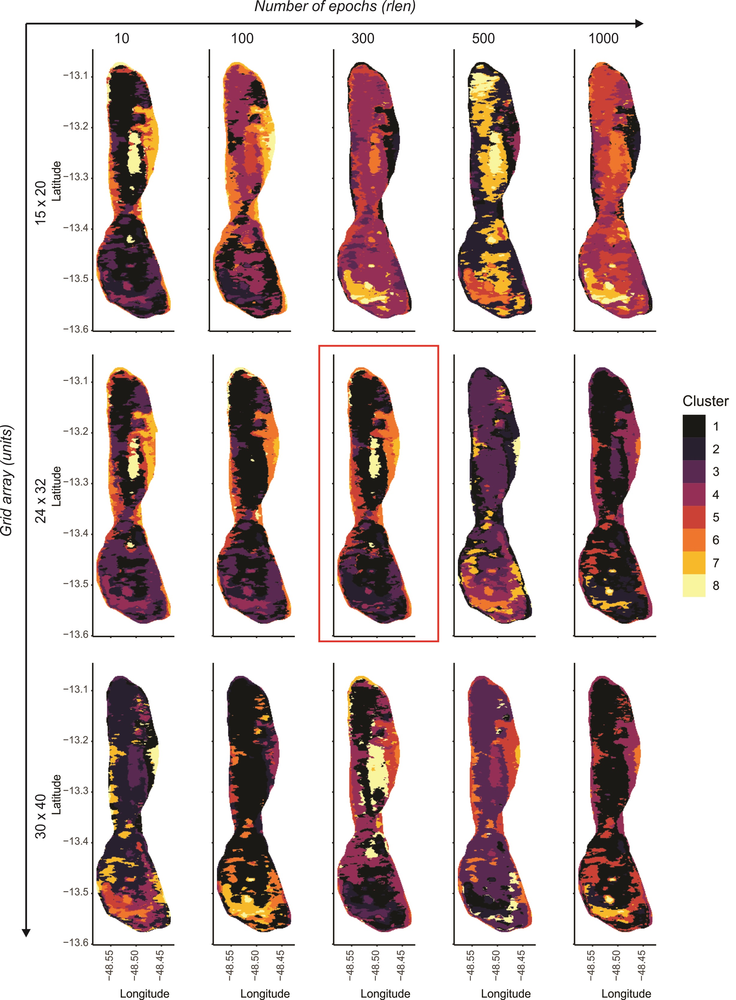

# SOMSerraDourada

This code is part of the article "Unveiling Geological Complexity in the Serra Dourada Granite Using Self-Organizing Maps and Hierarchical Clustering: Insights for REE Prospecting in the Goiás Tin Province, Central Brazil"

## Abstract
This study explores the use of Self-Organizing Maps (SOM) combined with hierarchical clustering to provide insights into the geological differentiation and mineral prospecting in the Serra Dourada Granite (SDG), part of the Goiás Tin Province. After some issues on the geological cartography of the SDG based on traditional approaches, such as the interpretation of outcrops and the limited geochemistry data, often struggle to capture the complexity of high-dimensional geophysical datasets. To address this, we apply unsupervised machine learning techniques to segment airborne geophysical data, providing a more nuanced understanding of the SDG internal structure. Using airborne gamma-ray data, we employed SOM for dimensionality reduction and data segmentation, supported by hierarchical clustering. This methodology enabled us to identify distinct geological units with greater accuracy and resolution than traditional methods such as Principal Component Analysis (PCA). The SOM-based approach retained the data's original topology and revealed fine-scale patterns within the dataset, distinguishing between areas affected by magmatic processes and those influenced by post-magmatic hydrothermalism and supergene leaching. The results indicate that some clusters are mainly associated with magmatic differentiation, characterized by average concentrations of potassium (K), equivalent thorium (eTh), and equivalent uranium (eU) and others show evidence of secondary processes, including hydrothermal alteration and weathering. Notably, Cluster 4 is spatially linked to REE-enriched plateaus and the Serra Verde Mine, reinforcing its significance for mineral exploration. The SOM model proved more effective than PCA at capturing non-linear relationships within the data. While PCA provided insights into the primary variance, it did not fully account for the complex geological processes at play. In contrast, the SOM model segmented the data into clusters that reflected both broad geophysical trends and localized variations, particularly in areas influenced by hydrothermalism and supergene processes. Our findings underscore the value of machine learning techniques, particularly SOM, in geoscientific data analysis. This approach provides a robust framework for integrating multivariate geophysical data, offering valuable insights for geological mapping and mineral exploration, especially in regions with complex geological histories. The methodology presented here can be adapted to other geological settings, enhancing the accuracy of subsurface mapping and identifying areas of economic interest, such as Rare Earth Element (REE) and other critical mineral deposits. 

## Dependency:
R (≥ 4.3.1).

### Code:
Access code via RMarkdown, PDF or html in the [./code](./code) folder

### Data:
Raw data is larger than 25MB and can be download in the following link [via Google Drive](https://drive.google.com/file/d/1wnh6f0XjAUU4V6UY0IkB9xD8KFee4Pw1/view?usp=sharing).

### Imports
``` r
library(tidyverse) # ggplot, dplyr, readr, tibble, readr
library(factoextra) # Cluster Vis and PCA
library(geoquimica) # Data transformation
library(kohonen) # Self Organizing Maps
library(doParallel) # Parallel Computing
library(foreach) # For loops
library(circlize) # Data vis
library(ggpubr) # Data vis
library(dendextend) # Dendograms and HClustering
library(pheatmap) # Dissimilarity matrix
```

<div style="width: 30%; height: 30%">
  
 

</div>

## Authors:
* [Guilherme Ferreira da Silva](https://cutt.ly/RdsGmT5), (SGB) (Mail to: guilherme.ferreira@sgb.gov.br)
* [Marcos Vinícius Ferreira](https://github.com/marcosbr) (SGB)
* Lucy Takehara Chemale (SGB)
* Igor Vasconcelos Santana (UFMG)
* Nilson Francisquini Botelho (UnB)

## Copyright and License

The source code for this work is licensed based on the GNU GENERAL PUBLIC LICENSE, see [LICENSE](LICENSE).
